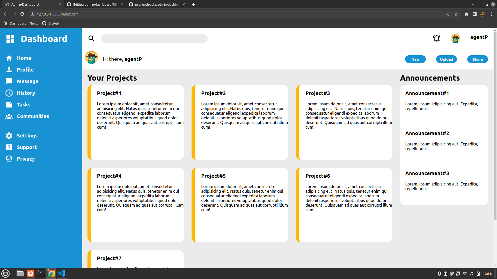

# Basic Admin-dashboard layout

[Live Demo](https://praneeth-ayla.github.io/admin-dashboard/) | [The Odin Project](https://www.theodinproject.com)

## Description

This project is part of The Odin Project curriculum. It's a simple web layout created using HTML and CSS. The purpose of this project is to practice building basic web pages and understanding the fundamentals of web development.

## Screenshot



This screenshot showcases the project's user interface.

## Usage

1. Clone the repository:

```bash
git clone https://github.com/praneeth-ayla/admin-dashboard.git
cd admin-dashboard
```
2. Open the project in your web browser by double-clicking the index.html file or using a local development server if you have one.

## Technologies Used

* HTML
* CSS

## About The Odin Project

The Odin Project is a free, open-source curriculum for learning web development. You can learn more about it [here](https://www.theodinproject.com).
